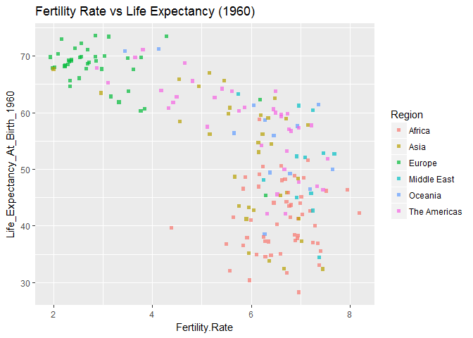
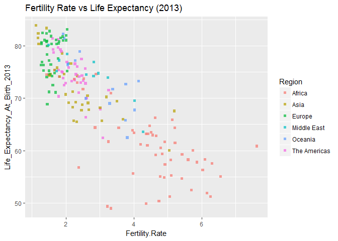

### Loading required packages

``` r
library(ggplot2)
```

### Loading the data

``` r
dfhm<- read.csv("Section5-Homework-Data.csv")
source("Section5-Homework-Vectors.R",echo=TRUE)
```

    ## 
    ## > Country_Code <- c("ABW", "AFG", "AGO", "ALB", "ARE", 
    ## +     "ARG", "ARM", "ATG", "AUS", "AUT", "AZE", "BDI", "BEL", "BEN", 
    ## +     "BFA", "BGD", "BGR ..." ... [TRUNCATED] 
    ## 
    ## > Life_Expectancy_At_Birth_1960 <- c(65.5693658536586, 
    ## +     32.328512195122, 32.9848292682927, 62.2543658536585, 52.2432195121951, 
    ## +     65.2155365 .... [TRUNCATED] 
    ## 
    ## > Life_Expectancy_At_Birth_2013 <- c(75.3286585365854, 
    ## +     60.0282682926829, 51.8661707317073, 77.537243902439, 77.1956341463415, 
    ## +     75.9860975 .... [TRUNCATED]

We have also been given separate vectors which have related information in them. We are going to combine those vectors into a dataframe (and merge them into the main dataframe later)

``` r
lifeExpentancy1960 <- data.frame(Country_Code,Life_Expectancy_At_Birth_1960)

lifeExpectancy2013 <- data.frame(Country_Code,Life_Expectancy_At_Birth_2013)
```

The above vectors contain lifeExpentancy based on country code and year

------------------------------------------------------------------------

### Exploring the data

``` r
head(dfhm)
```

    ##           Country.Name Country.Code       Region Year Fertility.Rate
    ## 1                Aruba          ABW The Americas 1960          4.820
    ## 2          Afghanistan          AFG         Asia 1960          7.450
    ## 3               Angola          AGO       Africa 1960          7.379
    ## 4              Albania          ALB       Europe 1960          6.186
    ## 5 United Arab Emirates          ARE  Middle East 1960          6.928
    ## 6            Argentina          ARG The Americas 1960          3.109

``` r
tail(dfhm)
```

    ##         Country.Name Country.Code      Region Year Fertility.Rate
    ## 369            Samoa          WSM     Oceania 2013          4.147
    ## 370      Yemen, Rep.          YEM Middle East 2013          4.284
    ## 371     South Africa          ZAF      Africa 2013          2.387
    ## 372 Congo, Dem. Rep.          COD      Africa 2013          6.103
    ## 373           Zambia          ZMB      Africa 2013          5.429
    ## 374         Zimbabwe          ZWE      Africa 2013          3.977

``` r
str(dfhm)
```

    ## 'data.frame':    374 obs. of  5 variables:
    ##  $ Country.Name  : Factor w/ 187 levels "Afghanistan",..: 8 1 4 2 176 6 7 5 9 10 ...
    ##  $ Country.Code  : Factor w/ 187 levels "ABW","AFG","AGO",..: 1 2 3 4 5 6 7 8 9 10 ...
    ##  $ Region        : Factor w/ 6 levels "Africa","Asia",..: 6 2 1 3 4 6 2 6 5 3 ...
    ##  $ Year          : int  1960 1960 1960 1960 1960 1960 1960 1960 1960 1960 ...
    ##  $ Fertility.Rate: num  4.82 7.45 7.38 6.19 6.93 ...

``` r
summary(dfhm)
```

    ##               Country.Name  Country.Code          Region         Year     
    ##  Afghanistan        :  2   ABW    :  2   Africa      :106   Min.   :1960  
    ##  Albania            :  2   AFG    :  2   Asia        : 66   1st Qu.:1960  
    ##  Algeria            :  2   AGO    :  2   Europe      : 80   Median :1986  
    ##  Angola             :  2   ALB    :  2   Middle East : 24   Mean   :1986  
    ##  Antigua and Barbuda:  2   ARE    :  2   Oceania     : 26   3rd Qu.:2013  
    ##  Argentina          :  2   ARG    :  2   The Americas: 72   Max.   :2013  
    ##  (Other)            :362   (Other):362                                    
    ##  Fertility.Rate 
    ##  Min.   :1.124  
    ##  1st Qu.:2.243  
    ##  Median :3.994  
    ##  Mean   :4.191  
    ##  3rd Qu.:6.252  
    ##  Max.   :8.187  
    ## 

``` r
head(lifeExpentancy1960)
```

    ##   Country_Code Life_Expectancy_At_Birth_1960
    ## 1          ABW                      65.56937
    ## 2          AFG                      32.32851
    ## 3          AGO                      32.98483
    ## 4          ALB                      62.25437
    ## 5          ARE                      52.24322
    ## 6          ARG                      65.21554

``` r
head(lifeExpectancy2013)
```

    ##   Country_Code Life_Expectancy_At_Birth_2013
    ## 1          ABW                      75.32866
    ## 2          AFG                      60.02827
    ## 3          AGO                      51.86617
    ## 4          ALB                      77.53724
    ## 5          ARE                      77.19563
    ## 6          ARG                      75.98610

Here observe that there are 2 years in the dataset : 1960 and 2013

------------------------------------------------------------------------

Separating the 2 years into separated dataframes

``` r
dfhm1960 <- dfhm[dfhm$Year== 1960,]
summary(dfhm1960)
```

    ##               Country.Name  Country.Code          Region        Year     
    ##  Afghanistan        :  1   ABW    :  1   Africa      :53   Min.   :1960  
    ##  Albania            :  1   AFG    :  1   Asia        :33   1st Qu.:1960  
    ##  Algeria            :  1   AGO    :  1   Europe      :40   Median :1960  
    ##  Angola             :  1   ALB    :  1   Middle East :12   Mean   :1960  
    ##  Antigua and Barbuda:  1   ARE    :  1   Oceania     :13   3rd Qu.:1960  
    ##  Argentina          :  1   ARG    :  1   The Americas:36   Max.   :1960  
    ##  (Other)            :181   (Other):181                                   
    ##  Fertility.Rate 
    ##  Min.   :1.940  
    ##  1st Qu.:4.311  
    ##  Median :6.210  
    ##  Mean   :5.537  
    ##  3rd Qu.:6.806  
    ##  Max.   :8.187  
    ## 

``` r
dfhm2013 <- dfhm[dfhm$Year==2013,]
summary(dfhm2013)
```

    ##               Country.Name  Country.Code          Region        Year     
    ##  Afghanistan        :  1   ABW    :  1   Africa      :53   Min.   :2013  
    ##  Albania            :  1   AFG    :  1   Asia        :33   1st Qu.:2013  
    ##  Algeria            :  1   AGO    :  1   Europe      :40   Median :2013  
    ##  Angola             :  1   ALB    :  1   Middle East :12   Mean   :2013  
    ##  Antigua and Barbuda:  1   ARE    :  1   Oceania     :13   3rd Qu.:2013  
    ##  Argentina          :  1   ARG    :  1   The Americas:36   Max.   :2013  
    ##  (Other)            :181   (Other):181                                   
    ##  Fertility.Rate 
    ##  Min.   :1.124  
    ##  1st Qu.:1.770  
    ##  Median :2.335  
    ##  Mean   :2.846  
    ##  3rd Qu.:3.790  
    ##  Max.   :7.623  
    ## 

Now we are going to merge the vectors (created while loading the data) into respective datasets

``` r
dfhm1960 <- merge(dfhm1960,lifeExpentancy1960, by.x ="Country.Code", 
                  by.y = "Country_Code")

dfhm2013<- merge(dfhm2013,lifeExpectancy2013, by.x = "Country.Code", 
                 by.y = "Country_Code")
```

### Research question

We are interested in finding out the relation between Life Expectancy and Fertility rate by Country region for both the years.

Note: I have used qplot to plot the graphs here

``` r
qplot(data= dfhm1960, x =Fertility.Rate , y= Life_Expectancy_At_Birth_1960, 
      colour= Region, shape= I(15), alpha= I(0.7),
      main = "Fertility Rate vs Life Expectancy (1960)")
```



``` r
qplot(data= dfhm2013, x =Fertility.Rate , y= Life_Expectancy_At_Birth_2013, 
      colour= Region, shape= I(15), alpha= I(0.7),
      main = "Fertility Rate vs Life Expectancy (2013)")
```



### Conclusion

-   Life expectancy of a lot of Countries have increased over the years from 40 - 60 years to 65 - 75 years.

-   Fertility rate has decreased over the years

#### REFERENCE

> Please note that the above datasets have been obtained from <https://www.superdatascience.com/> , obtained while pursuing a course by Kirill Eremenko
